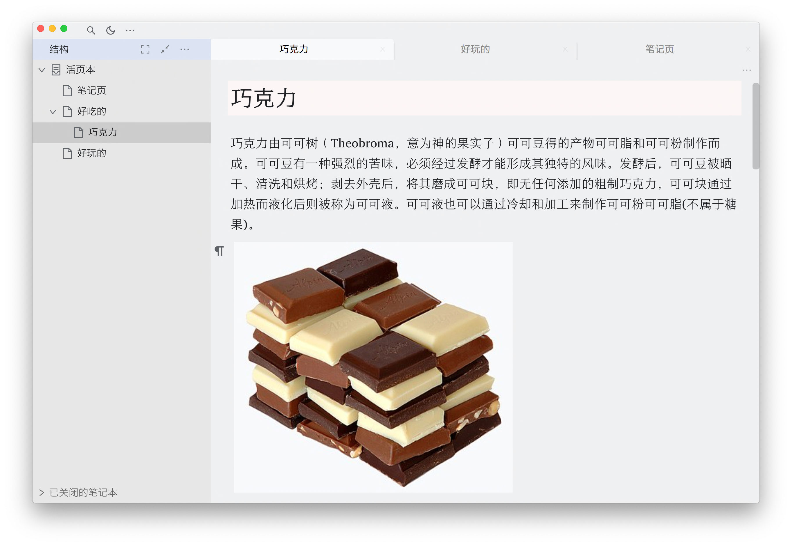
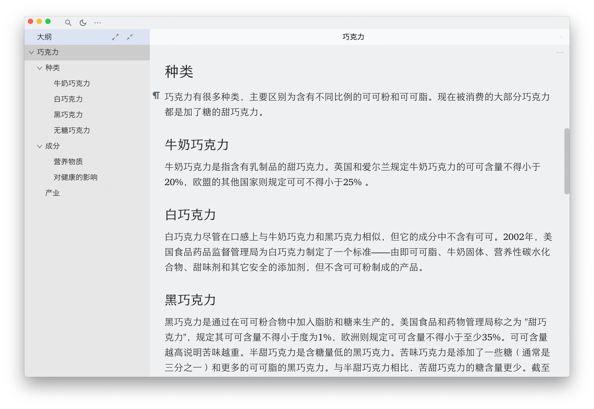
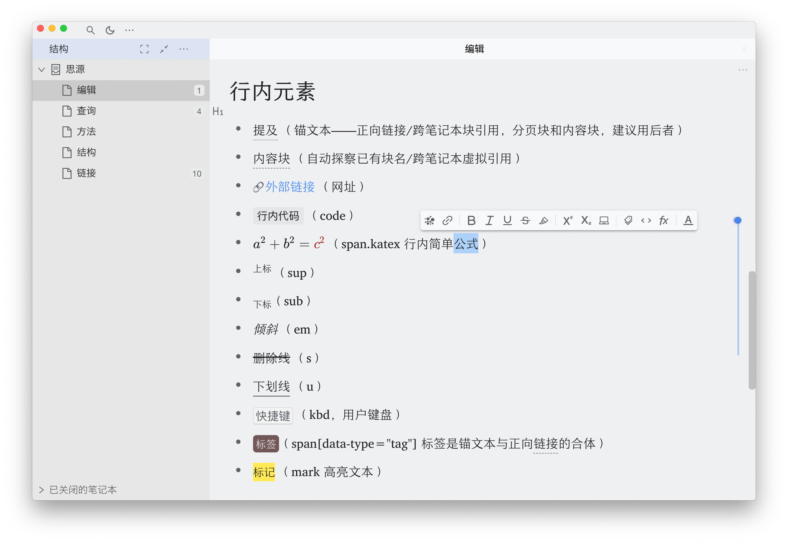

# concise 极简主题

## 介绍

本主题为极简而生，隐藏不必要的界面元素，可以使用快捷键打开隐藏的部分面板。相关快捷键请在设置面板中查询。

## 修改主题

如果你熟悉 css，可根据需要打开设置面板>外观>自定义当前主题，复制一份 Siyuan/conf/appearance/themes/concise-light/theme.css，改名为 custom.css，即可根据自己的需要在 concise 极简主题基础上进一步修改字体大小、颜色等等内容。

可参考，查看更多图片效果：

结构

大纲

编辑

