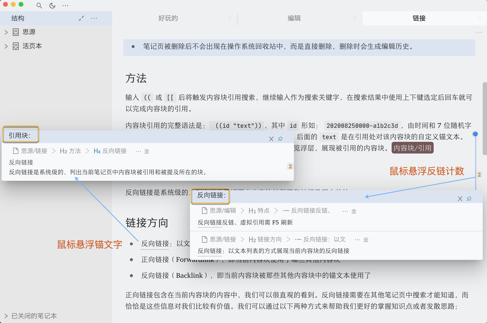

# concise 极简主题

## 介绍

隐藏一些不必要的界面元素。如果想恢复可以通过自定义方式修改。

将压缩包解压至 themes 目录，themes/concise-light 是明色主题，themes/concise-dark 是明色主题，

明色主题配套代码块主题，推荐在设置>代码块主题选择 atom-one-light。

暗色主题配套代码块主题，推荐在设置>代码块主题选择 atom-one-dark。

如果你熟悉 css，可根据需要自行更改 concise-light/theme.css 或者 concise-dark/theme.css。

## 快捷键

极简主题下，面板的打开/隐藏需要操作快捷键：

结构面板（文档树） Alt+1 / ⌥1

大纲面板 Alt+2 / ⌥2

书签面板 Alt+3 / ⌥3

标签面板 Alt+4 / ⌥4

日记 Alt+5 / ⌥5

反链/提及面板 Alt+7 / ⌥7

本页关系面板 Alt+8 / ⌥8

全局关系面板 Alt+9 / ⌥9

## 关于鼠标浮窗

由于思源笔记有三种浮窗，即悬停面包屑图标弹出的“块定位”、悬停锚文字弹出的“引用块”、悬停反链数字弹出的“反向链接”。它们统一使用一个元素属性`block__popover`，无法有效区分，无法一劳永逸用 css 实现“引用块”、“反向链接”浮窗提示。感觉有这个区分一下还是很有帮助的，特别是对新手。《思源笔记新手入门指南》里面的实现“引用块”、“反向链接”浮窗提示是判断“反向链接”浮窗的窗口位置，但无法在窗口位置改变、浮窗移动或浮窗无限套娃时保持正确。故在 theme.css 注释掉了。感兴趣的JS老铁可试试用 theme.js 实现。或者 D 大直接给三种`block__popover`加分类属性（其实加引用块、反向链接block__popover属性就够了），这样 css 定制一劳永逸。

