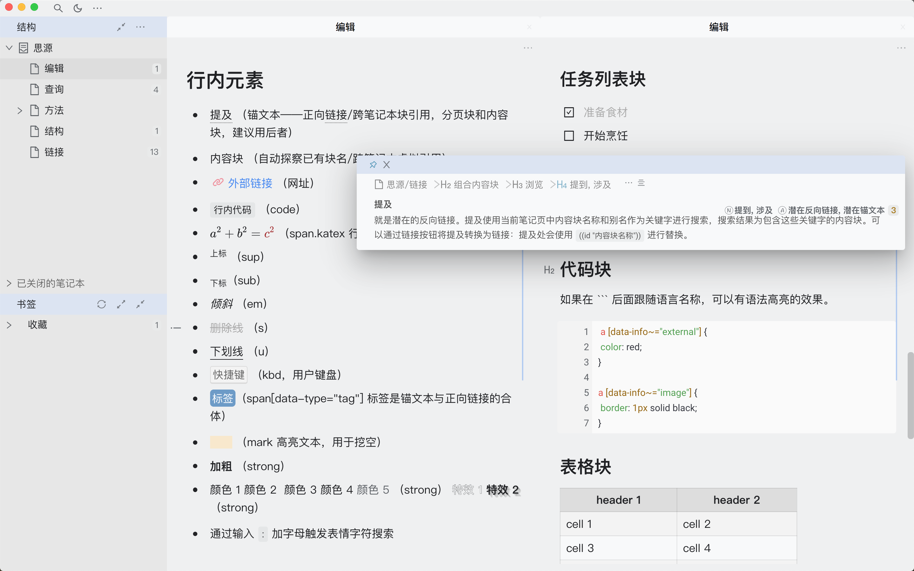

# concise 极简主题

## 介绍

本主题为极简而生，隐藏一些不必要的界面元素。如果想恢复可以通过自定义方式修改。

本主题在 Mac 系统测试生成，Win 系统是否有问题尚不清楚。

设置里代码块主题推荐 atom-one-light

## 自定义

如果你熟悉 css，可根据需要打开设置面板>外观>自定义当前主题，复制一份 Siyuan/conf/appearance/themes/concise-dark/theme.css，改名为 custom.css，即可根据自己的需要在 concise 极简主题基础上进一步修改字体大小、颜色等等内容。

## 快捷键

极简主题下，面板的打开/隐藏需要操作快捷键：

结构面板（文档树） Alt+1 / ⌥1

大纲面板 Alt+2 / ⌥2

书签面板 Alt+3 / ⌥3

标签面板 Alt+4 / ⌥4

日记 Alt+5 / ⌥5

反链/提及面板 Alt+7 / ⌥7

本页关系面板 Alt+8 / ⌥8

全局关系面板 Alt+9 / ⌥9

新手入门可参考[《思源笔记入门指南》](https://github.com/mindstudy/siyuan-intro)

## 关于鼠标浮窗

入门指南里有鼠标浮窗“引用块”、“反向链接”提示，这个提示对于新手来说比较友好。但是极简主题目前没有开启。原因在于这个功能实现有瑕疵，无法在无限套娃时保持正确。“反向链接”提示是通过窗口位置判断实现，由于每个人的电脑分辨率可能不同，所以无法保证每个人都正确。根本原因是单纯通过修改 css 无法获取某一特征元素的祖先级元素。（具体 css 代码注释掉后保留在 theme.css 里面供参考）

解决方法有：D大给反向链接数字鼠标浮窗的 `block__icon` 增加特征属性，这种方法一劳永逸；或者熟悉 JS 的老铁通过 theme.js 获取鼠标浮窗事件，添加 css。

