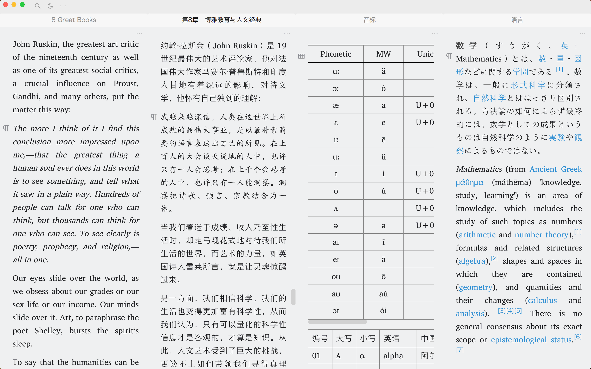

# concise 极简主题

## 介绍

隐藏一些不必要的界面元素。如果想恢复可以通过自定义方式修改。

明色主题配套代码块主题，推荐在设置>代码块主题选择 atom-one-light。

暗色主题配套代码块主题，推荐在设置>代码块主题选择 atom-one-dark。

如果你熟悉 css，可根据需要自行更改 concise-light/theme.css 或者 concise-dark/theme.css。

## 快捷键

极简主题下，面板的打开/隐藏需要操作快捷键：

结构面板（文档树） Alt+1 / ⌥1

大纲面板 Alt+2 / ⌥2

书签面板 Alt+3 / ⌥3

标签面板 Alt+4 / ⌥4

日记 Alt+5 / ⌥5

反链/提及面板 Alt+7 / ⌥7

本页关系面板 Alt+8 / ⌥8

全局关系面板 Alt+9 / ⌥9

